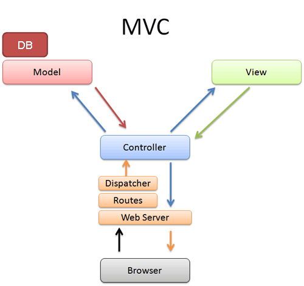

==================================
 Django: Web Application Framework
==================================

    Un framework per i perfezionisti con delle scadenze

.. sourcecode:: python

    >>> import django

.. class:: incremental 

* Introduzione
* MVC/MVT
* Ciao Mondo!
* ORM API

Cos'è un framework?
===================

    Un insieme di componenti software
    per costruire rapidamente applicativi

.. class:: incremental

* DRY
* Best Practices e Design Patterns
* Convenzioni e configurazioni

Perché Django?
==============
.. class:: incremental

* Comunità di utenti
* Documentazione eccellente
* Codice pulito, modulare
* Poca magia e niente lacci
* ORM eccezionale
* Scaffolding? No grazie.

Componenti del framework Django
===============================

.. class:: incremental

* ORM
* Templates
* Dispatcher

.. class:: incremental

... più tutta una serie di utilità, per esempio:

.. class:: incremental

* Forms
* Sessioni
* Autenticazione
* Pannello di amministrazione
* i18n

Il pattern MVC
====================

    MVC: **Model** - **View** - **Controller**

MVC alla Django: MVT
====================
    Django usa il pattern **Model** - **View** - **Template**

È essenzialmente un pattern **Model** - **View** - **Controller**
con una terminologia leggermente diversa

.. class:: center

    ===========  ============  ========================
    Pattern
    -------------------------  ------------------------
    MVC          Django MVT    Componente
    ===========  ============  ========================
    Model        Model         ORM
    View         Template      Template
    Controller   View          Dispatcher, urls e views
    ===========  ============  ========================

Progetti e applicazioni
=======================
In gergo Django:

.. class:: incremental

    * applicazione web: **project**
    * componente o modulo: **app**

    Django ci mette a disposizione una serie di
    comandi per compiere le più comuni operazioni
    di gestione e creazione di una applicazione web.

Progetto: creazione
===================
Per creare un nuovo progetto (vuoto) si utilizza il comando **startproject**:

.. sourcecode:: bash

    $ django-admin.py startproject workshop
    $ cd workshop/
    $ tree
    .
    |-- __init__.py
    |-- manage.py
    |-- settings.py
    `-- urls.py

Configurazione
==============

.. sidebar:: Backend disponibili

    - Postgresql
    - Oracle
    - MySQL
    - SqLite

.. container::

    .. sourcecode:: bash

        $ vim settings.py

    .. class:: incremental

    * Scelta lingua e TZ
    * Scelta backend

    .. class:: incremental

    -> Alessandro Furieri

Componenti: app
===============
Le **app** sono i componenti, o moduli (possibilmente
riutilizzabili) che compongono il nostro progetto.

Quasi tutte le funzionalità di Django sono disponibili
sotto forma di **app**.

.. sourcecode:: bash

    $ python manage.py startapp ciaomondo
    $ tree
    .
    |-- __init__.py
    |-- manage.py
    |-- ciaomondo
    |   |-- __init__.py
    |   |-- models.py
    |   |-- tests.py
    |   `-- views.py
    |-- settings.py
    `-- urls.py

Il controller
=============
Il controller instrada le richieste dei client verso le
viste (*views*) dei diversi componenti (*app*)

La configurazione delle rotte avviene tramite espressioni regolari
nei file convenzionalmente chiamati **urls.py**

.. sourcecode:: bash

    $ cat urls.py

.. sourcecode:: python

    from django.conf.urls.defaults import *
    
    urlpatterns = patterns('',
        url(r'^(?P<nome>\w+)$', 'ciaomondo.views.default'),
        url(r'^$', 'ciaomondo.views.default'),
    )

La rotta collega l'url alla vista di nome *default*.

Le rotte dei componenti
=======================

.. sidebar :: I riferimenti alle viste
    
    All'interno della funzione *url* le viste
    possono essere specificate sia come stringhe
    sia come *callable*

Le rotte del progetto generalmente delegano ai file **urls.py**
dei componenti

.. sourcecode:: bash

    $ cat urls.py

.. sourcecode:: python

    urlpatterns = patterns('',
        (r'^ciaomondo$', include('ciaomondo.urls')),
    )

La rotta include il file **urls.py** del componente

.. sourcecode:: bash

    $ cat ciaomondo/urls.py 

.. sourcecode:: python

    from django.conf.urls.defaults import *

    urlpatterns = patterns('',
        url(r'^.*$', 'ciaomondo.views.default'),
        url(r'^$', 'ciaomondo.views.default'),
    )

Le viste
========

.. sidebar:: Viste generiche

    Django ci fornisce diverse viste generiche, pronte da usare per i casi più frequenti:

    * lista/dettaglio
    * anno/mese/giorno

Le viste in Django hanno un'importanza più
limitata rispetto al classico pattern **MVC**,
generalmente si limitano a chiamare i metodi del modello
per manipolarlo o interrogarlo e a passare al template
le variabili corrette.

.. sourcecode:: bash

    $ cat ciaomondo/views.py

.. sourcecode:: python

    from django.shortcuts import render_to_response

    def default(request, nome = None):
        return render_to_response('default.html',
                                { 'nome' : nome})

I template
==========
    Django possiede un sistema di template estremamente
    versatile, tanto da poter sostituire in buona parte
    le viste.

variabili
    {{ nome_variabile }}

template tags
    

filtri
    {{ nome_variabile|iriencode }}

Template: variabili
===================
    Le variabili possono anche essere array o nomi di metodi senza argomenti.

{{ my_object.get_absolute_url }}
    get_absolute_url viene prima valutato come attributo, quindi come metodo

{{ my_object.children.0 }}
    ritorna il primo elemento della proprietà children, che è una lista

Template: tags
===================
    I tags predefiniti consentono di eseguire istruzioni condizionali e cicli.
    È anche possibile creare tag personalizzati.

.. sourcecode:: html

    <ul>
    
        <li>{{ animale.nome }}</li>
    
        <li>Nessun animale in elenco.</li>
    
    </ul>

Il debug
========

.. sidebar :: Debug e log
    
    È possibile anche utilizzare
    il log standard di python o
    usare il debugger di  *ipython*
    al posto di *pdb*

    Django in modalità DEBUG
    stampa a video uno stack
    trace degli errori.

 .. sourcecode:: python

    import pdb
    pdb.set_trace()
   

I modelli
=========

    Il modello descrive una classe di oggetti. A parte
    i modelli astratti, tutti i modelli vengono mappati
    su una tabella nel database.

Sono disponibili tutti i tipi di campi normalmente
supportati dai *backend* RDBMS, per esempio:

* BooleanField
* TextField
* DateField
* FloatField
* DecimalField
* ...

I modelli: campi "speciali"
===========================

\.\.\. ci sono anche campi *speciali* \.\.\.

* EmailField
* FileField
* ImageField
* IPAddressField
* SlugField
* URLField
* CommaSeparatedIntegerField
* ...

I modelli: campi "geo"
======================

\.\.\. e i campi *GEO*, disponibili in **GeoDjango**

* PointField
* LineStringField
* PolygonField
* MultiPointField
* MultiLineStringField
* MultiPolygonField
* GeometryCollectionField

... e il nuovo *GeometryField*

Un semplice modello
===================
    Un modello per rappresentare avvistamenti di animali.

.. sidebar:: Animali

    .. image :: images/foto/lupo.jpg
        :scale: 10%

    .. image :: images/foto/volpe.jpg
        :scale: 20%

    .. image :: images/foto/orso.jpg
        :scale: 20% 

Animale:
    * nome
    
Avvistamento:
    * animale (chiave esterna)
    * data

Un semplice modello
===================
.. sourcecode:: bash

    $ python manage.py startapp fauna
    $ cd fauna && vim models.py

.. sourcecode:: python

    from django.db import models

    class Animale(models.Model):
        """Modello per rappresentare gli animali"""
        nome = models.CharField(max_length=50, unique=True)

        def __unicode__(self):
            return '%s' % (self.nome)

    class Avvistamento(models.Model):
        """Modello per gli avvistamenti"""
        data = models.DateTimeField()
        animale = models.ForeignKey(Animale)

        def __unicode__(self):
            return '%s - %s' % (self.data, self.animale)

Crazione automatica delle tabelle
=================================

.. sourcecode:: bash

    $ python manage.py sqlall fauna

.. sourcecode:: sql

    BEGIN;
    CREATE TABLE "fauna_animale" (
        "id" serial NOT NULL PRIMARY KEY,
        "nome" varchar(50) NOT NULL UNIQUE
    )
    ;
    CREATE TABLE "fauna_avvistamento" (
        "id" serial NOT NULL PRIMARY KEY,
        "data" timestamp with time zone NOT NULL,
        "animale_id" integer NOT NULL REFERENCES "fauna_animale" ("id")
                        DEFERRABLE INITIALLY DEFERRED
    )
    ;
    CREATE INDEX "fauna_avvistamento_animale_id"
                        ON "fauna_avvistamento" ("animale_id");
    COMMIT;

Creazione DB e sync
===================
    I comandi di gestione di Django allineano il DB con
    il modello. Unico neo: mancano le migrazioni.

.. sourcecode:: bash

    $ createdb -E UTF-8 -T template_postgis fauna
    $ python manage.py syncdb
    Creating table fauna_animale
    Creating table fauna_avvistamento
    Installing index for fauna.Avvistamento model

ORM API
=======
    Tramite le API di Django possiamo interagire direttamente
    con il DB e capire come funziona. Sono disponibili tutte
    le operazioni CRUD e di interrogazione

.. sourcecode:: bash

    $ python manage.py shell

    >>> from fauna.models import *
    >>> Animale(nome='Orso').save()
    >>> Animale(nome='Lupo').save()
    >>> volpe=Animale()
    >>> volpe.nome='Volpe'
    >>> volpe.save()
    >>> volpe.pk
    3L
    >>> primate = Animale(nome='Umano')
    >>> primate.save()
    >>> primate.nome = 'Babbuino'
    >>> primate.save()
    >>> primate.delete()

ORM Interrogazione
==================

.. sidebar:: Filtri

    È possibile interrogare il DB tramite filtri sui valori dei
    campi.

    I filtri si costruiscono collegando
    il nome del campo con due trattini bassi
    (*underscore*)

.. sourcecode:: python

    >>> Animale.objects.get(nome='Orso')
    <Animale: Orso>
    >>> Animale.objects.all()
    [<Animale: Lupo>, <Animale: Orso>, <Animale: Volpe>]
    >>> Animale.objects.filter( nome__contains='l')
    [<Animale: Volpe>]
    >>> Animale.objects.filter( nome__icontains='l')
    [<Animale: Lupo>, <Animale: Volpe>]

.. footer:: Alessandro Pasotti - www.itopen.it

ORM Filtri
==========

    Il filtri di ricerca nelle interrogazioni permettono
    una granularità elevata, è anche possibile cercare nei
    valori di tabelle collegate.

    Le interrogazioni possono anche essere eseguite sulle istanze.

.. sourcecode:: python

    >>> Avvistamento.objects.filter( animale=Animale.objects.get(pk=1))
    [<Avvistamento: Orso - 2010-02-27 00:00:00>, ...]
    >>> avv = Avvistamento.objects.filter( animale__nome='Orso')
    >>> avv.count()
    6
    >>> avv
    [<Avvistamento: Orso - 2010-02-27 00:00:00>, ...]

    >>> orso=Animale.objects.get(nome='Orso')
    >>> orso.avvistamento_set.all()
    >>> [<Avvistamento: Orso - 2010-02-27 00:00:00>, ...]

ORM Filtri
==========

.. class:: borderless

=============  ============  ============
exact          lte           day
iexact         startswith    week_day
contains       istartswith   isnull
icontains      endswith      search [#]_
in             iendswith     regex
gt             range [#]_    iregex
gte            year
lt             month
=============  ============  ============

.. [#] solo in MySQL
.. [#] SQL: BETWEEN
